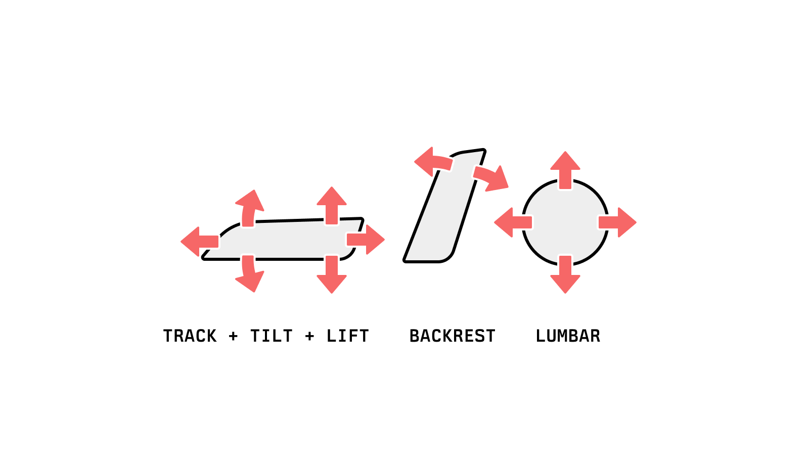
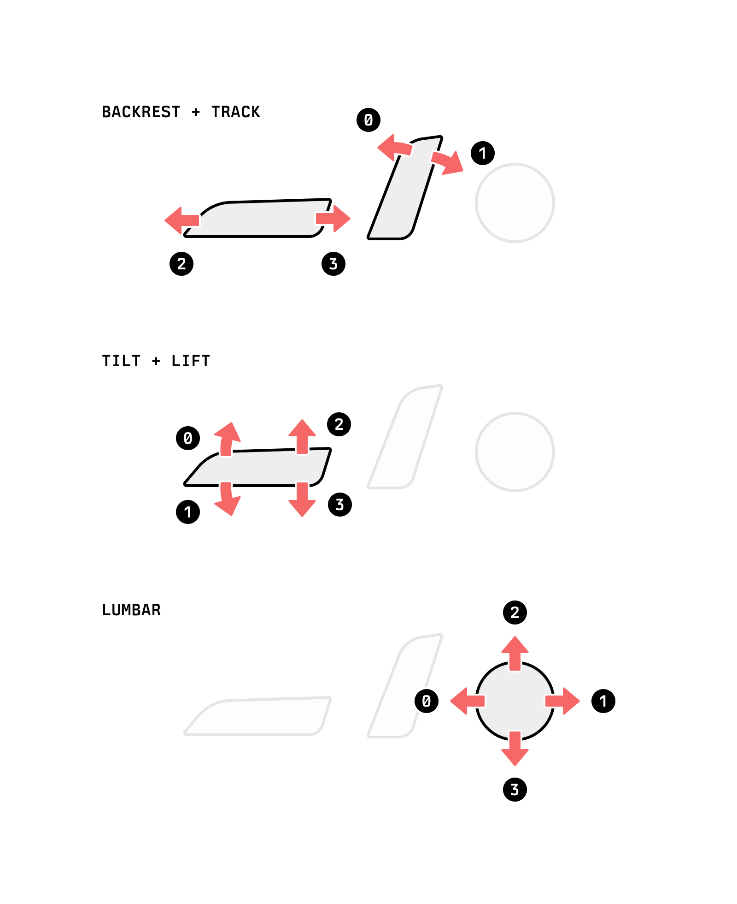

# Switchpack

The Tesla seat switchpack is the collection of controls on the side of the seat. There are three physical controls, connected via a four-wire harness.

Electrically, the switchpack interface has three signal wires and one ground line. When actuated, the switches assigned to each line vary the resistance of their corresponding wire.

| Numeric Index | Resistance Ω | Backrest + Track | Tilt + Lift | Lumbar |
| ------------- | -----------: | ---------------- | ----------- | ------ |
|               |        1.355 |                  |             |
| #0            |        1.179 | Backrest Fore    | Tilt Up     | Fore   |
| #1            |        0.774 | Backrest Aft     | Tilt Down   | Aft    |
| #2            |        1.010 | Track Fore       | Lift Up     | Up     |
| #3            |        0.677 | Track Aft        | Lift Down   | Down   |

## Electronics